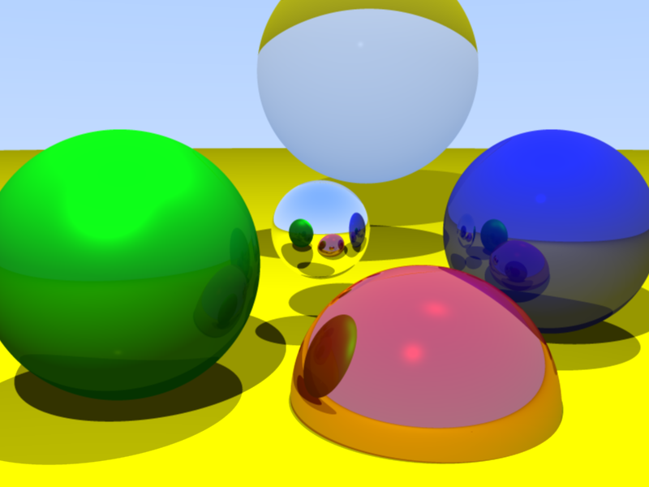

# RayTracing Project

A simple C++ ray tracer built with **CMake** and **Visual Studio**.

## 📷 Example Output

Render output generated by the ray tracer:



## Getting Started

### Prerequisites
Before you begin, ensure you have the following installed:
- **CMake** (v3.10 or later)
- **Visual Studio 17 2022**

### Build and Run
Run the provided batch script to build and execute the ray tracer:
```sh
 build.bat
```
During execution, you will be prompted to enter a filename. This will save the output as a **PPM** file inside the `output/` directory.

### 🔹 Running Manually
Alternatively, if you want to build and run manually:
```sh
mkdir build
cd build
cmake .. -G "Visual Studio 17 2022"
cmake --build . --config Release
cd ..
bin\raytracing.exe > output/render.ppm
```

## 📂 Project Structure
```
RayTracing/
├── bin/              # Compiled executable
├── build/            # CMake build files
├── include/          # Header files
├── src/              # Source code
│   └── raytracer.cpp # Raytracing Code
├── output/           # Rendered images (PPM format)
└── main.cpp          # Main entry point
├── CMakeLists.txt    # CMake build script
├── build.bat         # Windows build script
└── README.md         # This file
```
